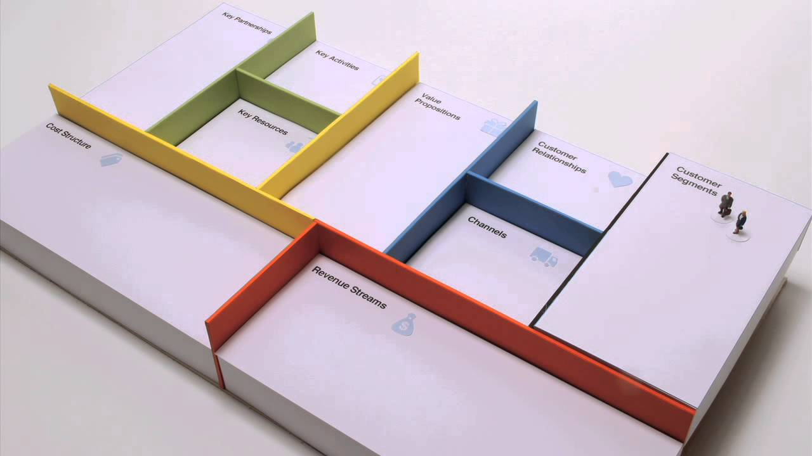

# Business Model Canvas Lecture

[ASSOCIATED LECTURE ON YOUTUBE](https://www.youtube.com/watch?v=8GIbCg8NpBw)

### Cracking the Code of Entrepreneurship

+ The tools we use in entrepreneurship are still pretty basic
  - ONE TOOL => Business Plan | BURN Business Plan because waste of time
  - "Plans are worthless but the planning is important"
  - **Plan your search** For the business model - once found THEN execute - shift
  - software supported tools to help us with our thinking...

1. CONCEPT
  + What is a business model?  As many answers as people in the room.
  + "Bla bla bla" phenomenon - words are not enough for business models
  + map them out - then ideas become clear
  + shared language for the construction and language of business models
  + "The Business Model Ontology" - PHD | Write a business best-seller : "Business Model Generation"
  + Business Model Canvas | 9 Building Blocks : You want to map them out on a single canvas
    1. Customer Segments
	2. Value Propositions
	3. Channels
	4. Customer Relationships
	5. Revenue Streams
	6. Key Resources
	7. Key Activities
	8. Key Partnerships
	9. Cost Structure

2. TOOLS
3. PROCESS

